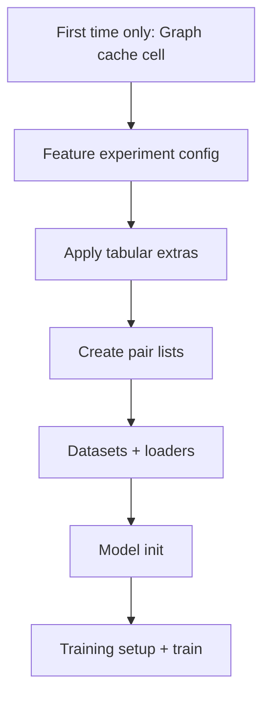

Here’s the workflow now wired into `mif-dti.ipynb`, and the best way to run multiple feature experiments.

## One place to edit

After the **graph cache** cell, use **Feature experiment config** (cell 19):

- `EXPERIMENT_NAME` — folder name for checkpoints/results, e.g. `"baseline"`, `"full"`, `"my_ablation_1"`
- `ACTIVE_PRESET` — `"baseline"` | `"minimal"` | `"full"` | `"custom"`
- For a custom column set: `ACTIVE_PRESET = "custom"` and edit the three lists in that cell

Presets:

| Preset | Drug extras | Protein extras |
|--------|-------------|----------------|
| `baseline` | none | none |
| `minimal` | `molecular_weight` | `aac_A`, `aac_R` |
| `full` | `molecular_weight` | isoform, transmem, pdb, AAC, PAAC, CTD polarizability (with aliases) |

Each run writes `dti_run/experiments/<EXPERIMENT_NAME>/feature_config.json` plus checkpoints there, so runs do not overwrite each other.

## What to re-run (important)

| What you changed | Re-run from |
|------------------|-------------|
| Feature columns or preset | **Feature experiment config** → **Apply tabular extras** → pairs → datasets → loaders → **model init** → training |
| Same features, new training only | Model init → training |
| Deleted graph `.pkl` files or new drugs/proteins | **Graph cache** cell first, then the row above |

You do **not** need to rebuild `kiba-ligand-hi.pkl` / `kiba-protein.pkl` when only tabular extras change — those stay in `SAVE_DIR` (`dti_run/`). Only the fast **Apply tabular extras** cell rebuilds scaled feature dicts.

You **must** re-run **model init** whenever `DRUG_EXTRA_DIM` or `PROT_EXTRA_DIM` changes (different column count → different MLP input size).

## Example A/B runs

**Baseline vs full features:**

1. `EXPERIMENT_NAME = "baseline"`, `ACTIVE_PRESET = "baseline"` → run config → apply → … → train  
2. `EXPERIMENT_NAME = "full"`, `ACTIVE_PRESET = "full"` → run config → apply → … → train  

Compare `dti_run/experiments/baseline/final_results.txt` vs `dti_run/experiments/full/final_results.txt`.

**Add one column:** set `ACTIVE_PRESET = "custom"` and append a column name that exists in `kiba.parquet` (numeric, constant per `Drug_ID` or `Target_ID`).

## Adding a new preset (optional)

Add an entry to `FEATURE_PRESETS` in the config cell, e.g. `"ctd_only"`, then set `ACTIVE_PRESET = "ctd_only"`.

---

**Notebook order now:** load/split → graph cache (slow) → feature guide (markdown) → config → apply extras → pairs → rest of pipeline.

If you use a copy under `Runners\MIF-DTI`, sync or re-copy `mif-dti.ipynb` so you get these cells there too.